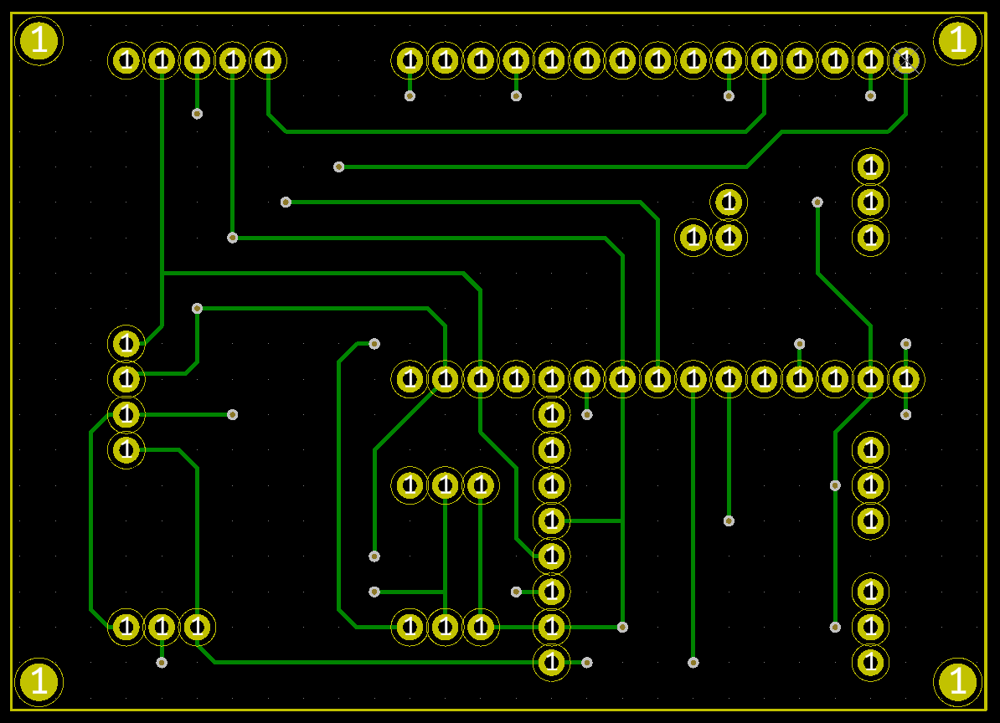

## This project and the repo are heavily WIP. I plan to publish everything as it's in the state to be published.

# ESPHome based multisensor

## Overview

Multisensor measuring temperature, humidity, air quality, brightness and movement. ESP board is a NodeMCU v2; Sensors are: SHT31, CCS811, BH1750 and AM312. An RGB LED indicates the air quality (good to bad or high humidity) whenever movement is detected. Using 3pin JST connectors three external sensors, running off of 3V can be attached. Two are digital only, one can be analog.
Components fit a standard 70x50mm prototype PCB. If you are the super-DIY-person everything can be soldered and wired up on a prototype PCB. If you want to avoid soldering too much and want to avoid wiring mistakes grab the PCB files, get PCBs manufactured and only solder the sensor modules.

## Case

Case is intended to be 3d printed. Sensors sit in indentations in printed top part, which requires lots of support structures for 3D printing. A simplified version that can be printed upside down is possible, but looks less nice. The case measures 76x56x20mm. Everything gets soldered onto the PCB, placed into the case, backside gets screwed onto the wall, frontcase snapfits in place.

## PCB

The PCB was intended to be hand solderable on a 70x50mm prototype-PCB. It's possible but time consuming. If more than one or two boards are required consider sending PCB files to a manufacturer of your choice. Therefore, the traces are held compatible to be used as an exact hand solder guide and are also fabrication ready. That results in some unnecessary vias.
Dependent on the position of a component hand soldering starts from one or the other side and sometimes an immediate layer change is required. For a manufactured board these additional vias are no problem.
A jumper can be used for changing one of the external sensors from digital to analog-in.

For manual soldering top traces are:

bottom traces are:

Use isolating tape / kapton tape on PCB to avoid shorts between both layers.

## Assembly

- 3D print the 3 parts: case front, case back and JST assembly guide
- get the PCBs (manufactured or DIYed)
- solder copper wire through JST-connector solder points

- place JST-connectors in assembly guide, place the PCB in there too

- solder JSTs to copper wire, cut off excess
- solder 3 pin header contacts for analog/digital select, place jumper accordingly; alternatively solder bridge

- solder sensor-modules, watch out that sensors face upright
- dependent on your AM312 pin headers can have the plastic piece so that its height will be increased. in that case remove the plastic of the pin header

- solder sensor-modules and NodeMCU to PCB

- place LED lens and light-sensor lens in case

- remove lens from AM312
- put PCB in place
- put lens on AM312
Done.

## Software

- create new sensor in ESPHome, settings aren't important here
- grab code from yaml-file, click "edit" for sensor in ESPHome, copy paste code - change according to your needs (e.g. make sure to enter your wifi-settings. I recommend to use the secrets-editor in ESPHome by clicking the three vertical dots in the very top right.)
- click the three vertical dots right of your sensor, click "compile", wait until it finishes, download binary
- get ESPHome-Flasher (google), connect Multisensor to your PC, make sure to use a cable with data lines!
- if the sensor doesn't get recognized make sure to have the driver for the CP210x USB-UART-controller installed
- in ESPHome-Flasher select correct serial port, select binary file, flash ESP
Done. If everything works correct you will see the sensor-log. From now on you can do modifications to the code over wifi.

## External Sensors

There are 3 JST connectors usable for simple external sensors running off of 3V. They can be used for super tiny 10x17x8mm DIY wired window/door contacts with hall effect sensors. (ToDo --> add to project)
One of the external sensors can be analog. Therefore, setting the jumper accordingly is required.
